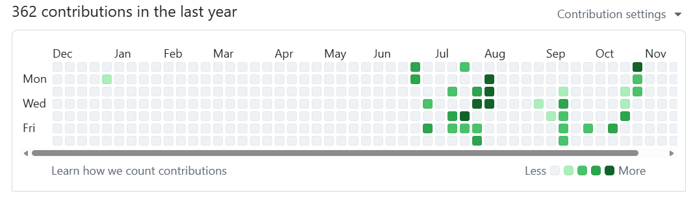
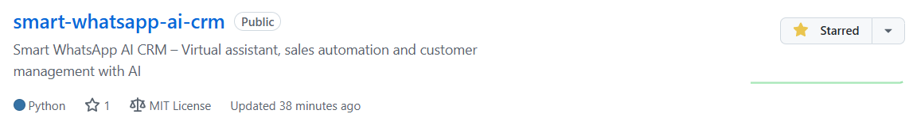

## 🎓 Certificações

 

  

 

  Certificada pela <strong>IBM</strong> — Machine Learning with Python 🧠

<h2 align="center">🌍 Criando projetos que conectam pessoas e tecnologia</h2>
<h3 align="center">🚀 Minha missão: levar IA e automação para o mundo real</h3>

  
  
  

  
  
  

<h3 align="center">💻 Dev Python | 🤖 Automação & IA | ⚙️ Projetos práticos e funcionais</h3>

---

## 💡 Sobre mim

🎯 **Especialista em automação de processos com Python e Inteligência Artificial aplicada, criando soluções práticas e de impacto.**

🚀 **Desenvolvo projetos que otimizam fluxos, eliminam tarefas repetitivas e aumentam a eficiência de negócios reais.**

👩‍💻 **Experiência sólida em integrações via APIs, escalabilidade e boas práticas de desenvolvimento.**

🌐 **Familiaridade com ferramentas no-code (Make, Zapier) e plataformas modernas de automação.**

📚 **Comprometida com evolução contínua, acompanhando tendências e aplicando as melhores práticas em IA e automação.**

---

## 🛠️ Tecnologias que uso

🐍 **Python** – Scripts, automações e integrações inteligentes  
🔧 **Flask | Pandas | Selenium | OpenAI | Gemini | APIs REST** – Soluções em dados e IA  
🌐 **Git | GitHub | VS Code | Google Colab** – Versionamento e colaboração  
📊 **Excel + Python** – Dashboards, relatórios e análises automatizadas  
⚡ **No-Code (Make, Zapier)** – Integração de fluxos inteligentes  
🚀 **Tecnologias emergentes** – Sempre explorando novas possibilidades para negócios

---

## 📌 Repositórios em Destaque

- 📁 [**smart-whatsapp-ai-crm**](https://github.com/NeusaM21/smart-whatsapp-ai-crm)  
  CRM inteligente para **WhatsApp com IA**, focado em **automação de vendas, atendimento em tempo real e qualificação de leads** usando **FastAPI, Google Gemini e PostgreSQL (Supabase)**.  
  Stack: Python · FastAPI · Google Gemini AI · PostgreSQL · SQLAlchemy Async · REST API

- 📁 [**enterprise-ai-automation-agent**](https://github.com/NeusaM21/enterprise-ai-automation-agent)  
  Agente corporativo de **IA + automação** que integra **WhatsApp, Shopify e Google Gemini AI** para suporte e vendas automatizadas.  
  Stack: Python · FastAPI · Gemini · Shopify API · WhatsApp API · REST API

- 📁 [**whatsapp-sheets-email-bot**](https://github.com/NeusaM21/whatsapp-sheets-email-bot)  
  Webhook do WhatsApp que salva leads no **Google Sheets** e envia e-mails automáticos via **Gmail (SMTP)**.  
  Stack: Python · Flask · Google Sheets API · Gmail SMTP · SQLite

- 📁 [**email_bot**](https://github.com/NeusaM21/email_bot)  
  Bot em Python para envio automático de e-mails personalizados via Excel.  
  Stack: Python · smtplib · pandas · Excel

- 📁 [**pdf-insight-bot**](https://github.com/NeusaM21/pdf-insight-bot)  
  Extração de respostas e insights de PDFs com IA usando **LangChain, Gemini, FAISS e Streamlit**.  
  Stack: Python · LangChain · FAISS · Streamlit · Gemini AI

- 📁 [**smart-integration-leads**](https://github.com/NeusaM21/smart-integration-leads)  
  Integração inteligente de leads com **Make + GPT + CRM**.  
  Stack: Make · GPT API · HubSpot · Google Sheets

- 📁 [**ecommerce-marketing-automation-project**](https://github.com/NeusaM21/ecommerce-marketing-automation-project)  
  Automação para e-commerce com IA, captação de leads e conversão em vendas.  
  Stack: Python · APIs · GPT · Google Ads · CRM

- 📁 [**projeto-portfolio**](https://github.com/NeusaM21/projeto-portfolio)  
  Repositório central com resumos de todos os projetos de automação e IA.  
  Stack: Markdown · GitHub · Documentação

---

## 📊 Estatísticas do GitHub

  
  

---

## 📫 Contato

📧 **E-mail**: [contact.neusam21@gmail.com](mailto:contact.neusam21@gmail.com)  
💼 **LinkedIn**: [https://www.linkedin.com/in/neusam21/](https://www.linkedin.com/in/neusam21/)  
🚀 **Aberta a freelas e colaborações internacionais**

---

## ✨ Curiosidade

> "Automação não é sobre substituir pessoas. É sobre **libertar tempo** para o que realmente importa."  
— **NeusaM21**

